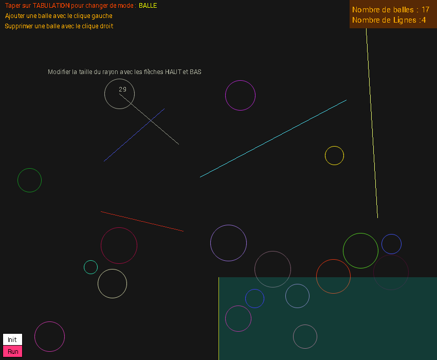

# Particules : Moteur physique
## Introduction
Réalisé en première année de licence informatique, le projet PARTICULES a pour objectif de recréer un moteur physique permettant de simuler des particules en mouvement dans un environnement 2D. 

Ce projet prend en charge les collisions, la force gravitationnelle et la poussée d'Archimède pour la partie aquatique.

### Caractéristiques
Language : C++  
Bibliothèque graphique : [GRAPIC](https://perso.liris.cnrs.fr/alexandre.meyer/grapic/html/)      
Année : 2019/2020 --  **L1 Informatique**

## Table des matières
1. [Arborecence du projet](#1---arborecence-du-projet)
2. [Lancement de l'application](#2---lancement-de-lapplication)

## 1-- Arborecence du projet

- **grapic.png**         : Image de présentation du projet
- **particules.cpp**      : Application principale
- **Rapport d'avancement.txt**  : Fichier retracant l'avancement du projet

## 2-- Lancement de l'application
> :warning: **Il est nécessaire d'installer la bibliothèque graphique GRAPIC pour lancer l'application.**

[Installer GRAPIC](https://perso.liris.cnrs.fr/alexandre.meyer/grapic/html/)

Il suffit ensuite de compiler puis de lancer le programme.